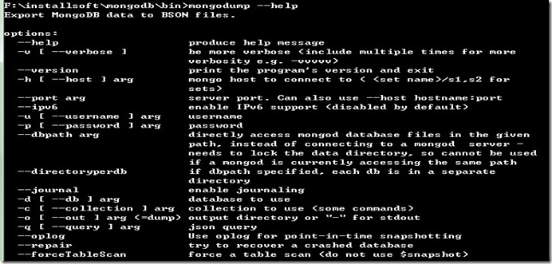
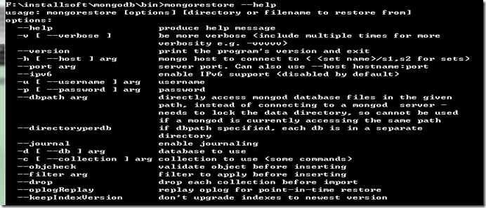
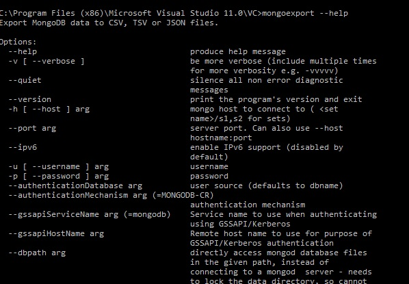

# 数据备份与恢复

## 通过拷贝数据文件备份（冷备份）
- 前提：前提是要停止MongoDB服务器
- 备份MongoDB数据：创建数据存储目录的副本即可，直接copy一份。 
- 恢复MongoDB数据：在MongoDB启动时用--dbpath指定数据存储目录副本位置。 
- 在服务器运行的情况下直接copy是有风险的，可能copy出来时，数据已经遭到破坏。

## 使用mongodump和mongorestore

### 使用mongodump备份数据

- mongodump命令将数据导出成BSON格式的数据。

- 示例： `mongodump -d mongodb -o backup`
- 注意
	- mongodump将数据导出为二进制格式文件
	- mongodump导出的数据不包括local数据库的数据
- 常用的选项
	- `--out <path>, -o <path>` 指定数据导出的位置。默认情况下，数据导出到当前工作目录下；
	- `--db <database>, -d <database>` 指定待导出数据的数据库。如果不指定，则导出所有数据库。

### 使用mongorestore恢复数据

- mongorestore将mongodump导出的BSON格式的备份文件导入数据库中。
- 示例： `mongorestore -d mongodb2 --drop backup/mongodb`
- 常用的选项
	- `--db <database>, -d <database>` 指定将被导入数据的数据库，如果数据库不存在，则自动创建。
	- `--drop` 在导入之前删除数据库中的集合。如果不删除，导入的数据可能和原来的数据合并在一起，或覆盖原来的数据。

## 使用mongoexport和mongoimport备份和恢复数据

### 使用mongoexport备份数据

- 使用mongoexport可以将数据导出为“人可读”的文件格式：JSON或CSV格式。
- 示例： `mongoexport -d test -c test_2 -f id,name,address --csv -o test_2.csv`
- 常用的选项
	- `--db <database>, -d <database>` 指定待导出数据的数据库
	- `--collection <collection>, -c <collection>` 指定待导出的集合
	- `--fields <field1[,field2]>, -f <field1[,field2]>` 指定需要导出的字段
	- `--out <file>, -o <file>` 指定导出文件的名称
	- `--csv` 导出为CSV格式，默认为JSON格式

### 使用mongoimport恢复数据

[mongoimport.jpg](mongoimport)
- 使用mongoimport可以将JSON或CSV格式的数据批量导入数据库中
- 示例： `mongoimport -d"mydb" -c"inventory" -f"date,id,views" --type=csv --file=data.csv`
- 常用的选项：与mongoexport类似

## fsync和锁方式

冷备份和mongodump方式的备份都不能保证备份时获取数据的实时性，因为我们在备份的时候可能还有数据在内存缓冲区中没有写入到磁盘，MongoDB给我们提供了fsync+lock机制就能满足我们的需求。

### 从属备份

## 参考资料
- [MongoDB 数据文件备份与恢复](http://www.open-open.com/lib/view/open1340532912749.html)