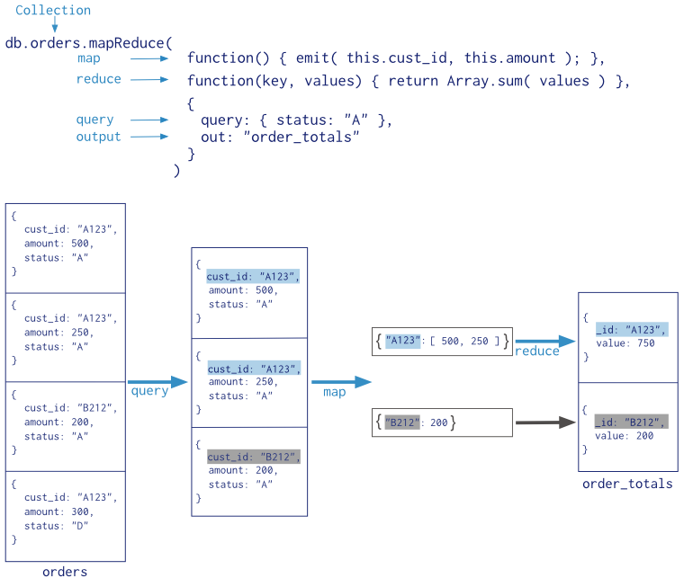

# 聚合

- 聚合是一种处理和计算数据，并返回结果的操作；
- MongoDB提供了丰富的聚合操作;
- 和查询操作一样，聚合操作使用文档的集合作为输入，输出一个或多个文档。

## 聚合模型

MongoDB提供**聚合管道**、*Map-Reduce**、**聚合函数**等几种模型。

### 聚合管道

在聚合管道模型中，集合中的文档通过多个阶段（stage）的管道不断过滤、合并、筛选，最终得出聚合结果。

### Map-Reduce

MapReduce是一中用于进行大数据聚合操作的模式，而不是一个特定的函数或软件。

- MapReduce操作一般分为两个阶段（stage）：
	- map阶段。map阶段处理每一个输入的文档，并将处理结果反射（emit）出去；
	- reduce阶段。reduce阶段用于合并map阶段发射来的结果。

- MapReduce还有一个可选的finalize阶段，此阶段用于对最后的输出结果进行处理；
- 此外，MongoDB中还可以为MapReduce操作提供一个query参数，用于对输入map阶段的文档进行筛选。
- 一般而言，MapReduce操作比管道方式更加低效。

### 聚合函数

使用聚合函数可以非常高效地实现简单的聚合功能。

## 深入学习

- [聚合管道]()