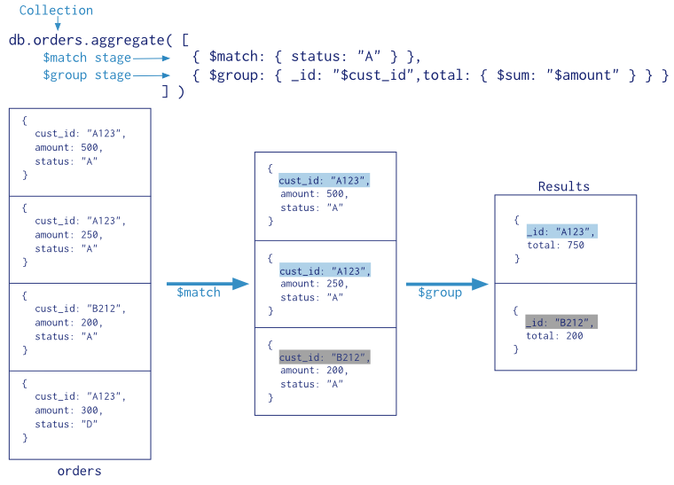

# 聚合管道

聚合管道示例


## 管道

- MongodDB聚合管道由多个阶段组成。每个阶段完成一个简单操作，以靠近最后的聚合目标。
- 在shell中，使用` db.collection.aggregate() `函数进行聚合管道操作。

### db.collection.aggregate(pipeline, options) 函数

聚合管道操作通过aggregate函数来实现，它需要两个参数：
- pipeline 是一个数组，包含了所有需要操作的阶段。pipeline也可以使用顺序的参数提供aggregate函数（2.6以上版本）。
- options 是可选的，且只有当pipeline作为一个数组传入的时候才可用。

## 管道表达式

- 每个阶段都需要输入一个管道表达式作为参数；
- 管道表达式的结构和文档一样，而且，它可以包含其他的表达式；
- 管道表达式只能操作当前管道中的文档，而不能引用其他的文档；
- 管道阶段中可用的表达式
	- 字段路径和系统变量，如$user, 表示引用user字段的值，$user.name 表示引用user.name字段的值。
	- 文本。当我们需要避免表达式解析文本时，可以使用$literal。
	- 表达式对象：`{ <field1>: <expression1>, ... }`
	- 运算符表达式： `{ <operator>: [ <argument1>, <argument2> ... ] }`

## 聚合管道的行为特征

- `aggregate`函数只能操作单个集合；
- 默认情况下，传递给`aggregate`的参数是整个集合的文档；

## 实例（Zip Codes）

### 数据模型

```
{
  "_id": "10280",
  "city": "NEW YORK",		// 市
  "state": "NY",			// 州
  "pop": 5574,				// 人口数
  "loc": [					// 经纬度
    -74.016323,
    40.710537
  ]
}
```

### 找到人口数大于1000万的州

```
db.zipcodes.aggregate( [
   { $group: { _id: "$state", totalPop: { $sum: "$pop" } } },
   { $match: { totalPop: { $gte: 10*1000*1000 } } }
] )
```

在这个示例中，管道中有两个阶段：$group 和 $match
- $group 阶段将集合中的所有文档按照state字段进行分组，并计算每组中pop字段的和，计算结果被赋值给totalPop字段；
- $match 阶段对上一阶段的输出结果进行筛选。筛选出totalPop的值大于等于1000万的文档。

输出结果：

```
{
  "_id" : "AK",
  "totalPop" : 550043
}
```

相应的SQL语句：

```
SELECT state, SUM(pop) AS totalPop
FROM zipcodes
GROUP BY state
HAVING totalPop >= (10*1000*1000)
```

### 按州查询城市人口平均值

```
db.zipcodes.aggregate( [
   { $group: { _id: { state: "$state", city: "$city" }, pop: { $sum: "$pop" } } },
   { $group: { _id: "$_id.state", avgCityPop: { $avg: "$pop" } } }
] )
```

- 第一个$group阶段将文档按照state和city进行分组，并计算city的总人口。在此阶段后，获得的文档如下所示：

	```
	{
	  "_id" : {
	    "state" : "CO",
	    "city" : "EDGEWATER"
	  },
	  "pop" : 13154
	}
	```

- 第二个$group阶段将文档按照_id.state进行分组，并计算每个组的人口平均数。

最后输出结果如下所示：

```
{
  "_id" : "MN",
  "avgCityPop" : 5335
}
```

### 找到每个州中人口最多和最少的城市

```
db.zipcodes.aggregate( [
   { $group:
      {
        _id: { state: "$state", city: "$city" },
        pop: { $sum: "$pop" }
      }
   },
   { $sort: { pop: 1 } },
   { $group:
      {
        _id : "$_id.state",
        biggestCity:  { $last: "$_id.city" },
        biggestPop:   { $last: "$pop" },
        smallestCity: { $first: "$_id.city" },
        smallestPop:  { $first: "$pop" }
      }
   },

  // the following $project is optional, and
  // modifies the output format.

  { $project:
    { _id: 0,
      state: "$_id",
      biggestCity:  { name: "$biggestCity",  pop: "$biggestPop" },
      smallestCity: { name: "$smallestCity", pop: "$smallestPop" }
    }
  }
] )
```

- 第一个$group阶段将文档按照state和city进行分组，并计算city的总人口；
- $sort阶段将文档按照pop的升序进行排序；
- 第二个$group阶段排好序的文档按_id.state进行分组，$last指向pop最大的文档，$first指向pop最小的文档；
- $project阶段是一个可选的，它用来重新格式化输出结果。

输出结果：

```
{
  "state" : "RI",
  "biggestCity" : {
    "name" : "CRANSTON",
    "pop" : 176404
  },
  "smallestCity" : {
    "name" : "CLAYVILLE",
    "pop" : 45
  }
}
```

## 聚合管道优化

## 聚合管道的限制

### 执行结果的尺寸限制

当聚合操作返回的结果是一个单一的文档，那么此文档的大小必须小于 BSON Document Size的控制大小，默认是16M。

## 参考

### 阶段

每个聚合管道操作都由一组阶段组成。除了$out和$geoNear之外，所有阶段都可以在管道中出现多次。

#### $project

#### $match

#### $redact

#### $limit

#### $skip

#### unwind

#### $group

##### 作用
将文档按照给定的表达式分组，并将每个组当作一个文档输出到下一个阶段。

##### 用法

```
{ $group: { _id: <expression>, <field1>: { <accumulator1> : <expression1> }, ... } }

```

- `_id` 字段是必须的，它指定了用于分组的唯一的键；
- `_id`和`accumulator`的值可以是任何的表达式;

#### $sort

#### $geoNear

#### $out