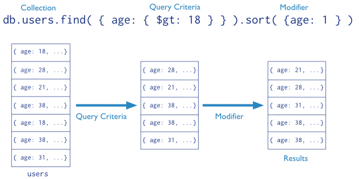
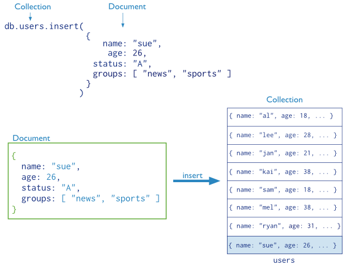

# MonogoDB CRUD 操作基础

## 查询（R）

- 查询：根据指定的条件（criteria, condition）返回一组特定的文档
- 一个查询返回的数据可能是所匹配文档的投影（projection），而不是完整的文档
- 在查询中，还可以使用查询选项：`limit`、`skip`、`sort`等

下图中，the query process specifies a query criteria and a sort modifier（修改器）:

## 读操作

* [Read Operations Overview](read-operations-overview.md)
* [游标](cursors.md)
* [查询优化](query-optimization.md)
* [Query Plans](query-plans.md)
* [Distributed Queries](distributed-queries.md)

## 数据修改（CUD）

- 数据修改包括数据的插入、更新、删除操作；
- 在MongoDB中，数据修改的操作只影响一行数据；
- 对于更新和删除操作，我们需要为它指定查询条件以便于选择需要更新或删除的文档。

In the following diagram, the insert operation adds a new document to the users collection.

## 写操作

* [写操作概述](write-operations-overview.md)
* [Write Concern](write-concern.md)
* [Atomicity and Transactions](atomicity-and-transactions.md)
* [Distributed Write Operations](distributed-write-operations.md)
* [Write Operation Performance](write-operation-performance.md)
* [Bulk Write Operations](bulk-write-operations.md)
* [Storage](storage.md)

## Related Features

### Indexes
To enhance the performance of common queries and updates, MongoDB has full support for secondary indexes. These indexes allow applications to store a view of a portion of the collection in an efficient data structure. Most indexes store an ordered representation of all values of a field or a group of fields. Indexes may also enforce uniqueness, store objects in a geospatial representation, and facilitate text search.

### Replica Set Read Preference
For replica sets and sharded clusters with replica set components, applications specify read preferences. A read preference determines how the client direct read operations to the set.

### Write Concern
Applications can also control the behavior of write operations using write concern. Particularly useful for deployments with replica sets, the write concern semantics allow clients to specify the assurance that MongoDB provides when reporting on the success of a write operation.

### Aggregation
In addition to the basic queries, MongoDB provides several data aggregation features. For example, MongoDB can return counts of the number of documents that match a query, or return the number of distinct values for a field, or process a collection of documents using a versatile stage-based data processing pipeline or map-reduce operations.
