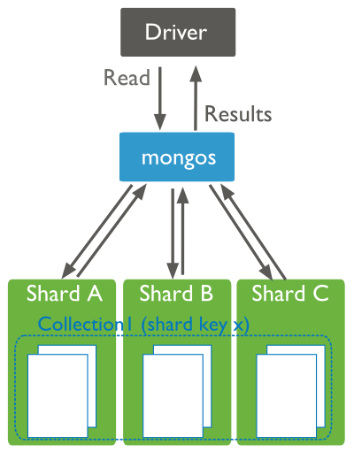

# Distributed Queries

## Read Operations to Sharded Clusters

Sharded clusters allow you to partition a data set among a cluster of mongod instances in a way that is nearly transparent to the application. For an overview of sharded clusters, see the Sharding section of this manual.

For a sharded cluster, applications issue operations to one of the mongos instances associated with the cluster.

Read operations on sharded clusters are most efficient when directed to a specific shard. Queries to sharded collections should include the collection’s shard key. When a query includes a shard key, the mongos can use cluster metadata from the config database to route the queries to shards.

Read operations to a sharded cluster. Query criteria includes the shard key. The query router ``mongos`` can target the query to the appropriate shard or shards.

If a query does not include the shard key, the mongos must direct the query to all shards in the cluster. These scatter gather queries can be inefficient. On larger clusters, scatter gather queries are unfeasible for routine operations.

## Read Operations to Replica Sets

Replica sets use read preferences to determine where and how to route read operations to members of the replica set. By default, MongoDB always reads data from a replica set’s primary. You can modify that behavior by changing the read preference mode.

You can configure the read preference mode on a per-connection or per-operation basis to allow reads from secondaries to:

reduce latency in multi-data-center deployments,
improve read throughput by distributing high read-volumes (relative to write volume),
for backup operations, and/or
to allow reads during failover situations.

Read operations from secondary members of replica sets are not guaranteed to reflect the current state of the primary, and the state of secondaries will trail the primary by some amount of time. Often, applications don’t rely on this kind of strict consistency, but application developers should always consider the needs of their application before setting read preference.

For more information on read preference or on the read preference modes, see Read Preference and Read Preference Modes.