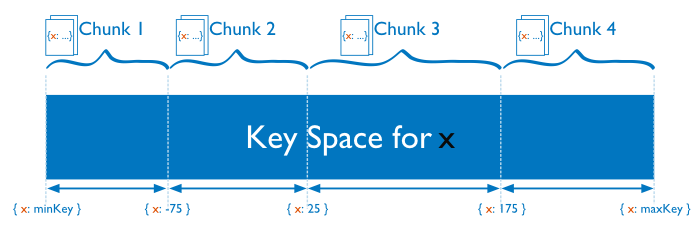

# Distributed Write Operations

## Write Operations on Sharded Clusters

For sharded collections in a sharded cluster, the mongos directs write operations from applications to the shards that are responsible for the specific portion of the data set. The mongos uses the cluster metadata from the config database to route the write operation to the appropriate shards.

.png)

MongoDB partitions data in a sharded collection into ranges based on the values of the shard key. Then, MongoDB distributes these chunks to shards. The shard key determines the distribution of chunks to shards. This can affect the performance of write operations in the cluster.

IMPORTANT
Update operations that affect a single document must include the shard key or the _id field. Updates that affect multiple documents are more efficient in some situations if they have the shard key, but can be broadcast to all shards.
If the value of the shard key increases or decreases with every insert, all insert operations target a single shard. As a result, the capacity of a single shard becomes the limit for the insert capacity of the sharded cluster.

For more information, see Sharded Cluster Tutorials and Bulk Write Operations.

## Write Operations on Replica Sets

In replica sets, all write operations go to the set’s primary, which applies the write operation then records the operations on the primary’s operation log or oplog. The oplog is a reproducible sequence of operations to the data set. Secondary members of the set are continuously replicating the oplog and applying the operations to themselves in an asynchronous process.

Large volumes of write operations, particularly bulk operations, may create situations where the secondary members have difficulty applying the replicating operations from the primary at a sufficient rate: this can cause the secondary’s state to fall behind that of the primary. Secondaries that are significantly behind the primary present problems for normal operation of the replica set, particularly failover in the form of rollbacks as well as general read consistency.

To help avoid this issue, you can customize the write concern to return confirmation of the write operation to another member [1] of the replica set every 100 or 1,000 operations. This provides an opportunity for secondaries to catch up with the primary. Write concern can slow the overall progress of write operations but ensure that the secondaries can maintain a largely current state with respect to the primary.

.png)

For more information on replica sets and write operations, see Replica Acknowledged, Oplog Size, and Change the Size of the Oplog.

[1]
Intermittently issuing a write concern with a w value of 2 or majority will slow the throughput of write traffic; however, this practice will allow the secondaries to remain current with the state of the primary.

Changed in version 2.6: In Master/Slave deployments, MongoDB treats w: "majority" as equivalent to w: 1. In earlier versions of MongoDB, w: "majority" produces an error in master/slave deployments.