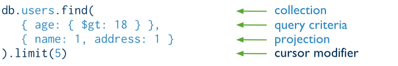
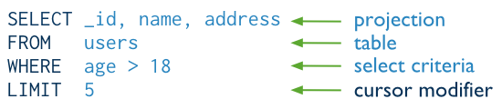
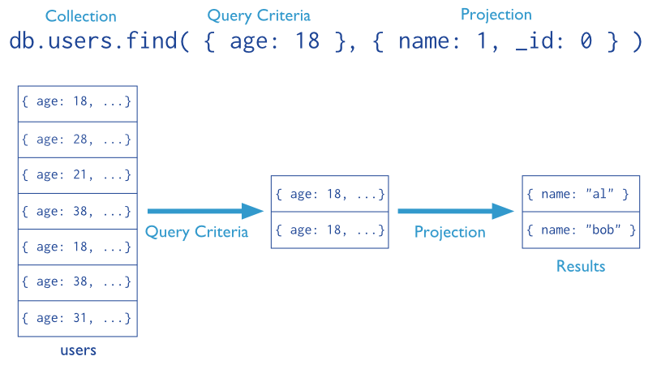

# Read Operations Overview

## 查询接口（Query Interface）

- `db.collection.find()` 方法
- 该方法接受两个参数：查询文档和投影（projection）选项
- 该方法返回一个游标
- 可以对查询结果使用查询选项

The following diagram highlights the components of a MongoDB query operation:




The next diagram shows the same query in SQL:



示例

```
db.users.find( { age: { $gt: 18 } }, { name: 1, address: 1 } ).limit(5)
```


## 查询的行为特征（Query Behavior）

MongoDB queries exhibit the following behavior:

- 查询只能在一个集合中进行查找
- 可以使用查询选项
- 默认情况下，查询返回的文档是无序的
- 修改数据的所有操作都使用相同的查询语法来筛选并更新文档
- 可以使用`db.collection.findOne()`方法来返回一个单独的文档
- In aggregation pipeline, the $match pipeline stage provides access to MongoDB queries.

## 查询语句（Query Statements）

### 投影（Projections）

- 默认情况下，查询返回符合条件的文档的所有字段；
- To limit the amount of data that MongoDB sends to applications, include a projection in the queries.
- By projecting results with a subset of fields, applications reduce their network overhead and processing requirements.
- 投影操作可以指定返回的数据包含或排除指定的字段
- 除了 `_id` 字段，在一个查询语句中不能混合使用“排除（exclusive）”与“包含（inclusive）”。

Consider the following diagram of the query process that specifies a query criteria and a projection:



In the diagram, the query selects from the users collection. The criteria matches the documents that have age equal to 18. Then the projection specifies that only the name field should return in the matching documents.

### 投影示例

#### 从返回结果中排除一个字段

`db.records.find( { "user_id": { $lt: 42 } }, { "history": 0 } )`

This query selects documents in the records collection that match the condition { "user_id": { $lt: 42 } }, and uses the projection { "history": 0 } to exclude the history field from the documents in the result set.

#### 返回结果只包含`_id` 和另外两个字段

`db.records.find( { "user_id": { $lt: 42 } }, { "name": 1, "email": 1 } )`

This query selects documents in the records collection that match the query { "user_id": { $lt: 42 } } and uses the projection { "name": 1, "email": 1 } to return just the _id field (implicitly included), name field, and the email field in the documents in the result set.

#### 返回结果只包含两个字段

`db.records.find( { "user_id": { $lt: 42} }, { "_id": 0, "name": 1 , "email": 1 } )`

This query selects documents in the records collection that match the query { "user_id": { $lt: 42} }, and only returns the name and email fields in the documents in the result set.


### Projection Behavior

MongoDB projections have the following properties:

- 默认情况下，返回值中包含“_id”字段
- For fields that contain arrays, MongoDB provides the following projection operators: $elemMatch, $slice, and $.
- For related projection functionality in the aggregation framework pipeline, use the $project pipeline stage.