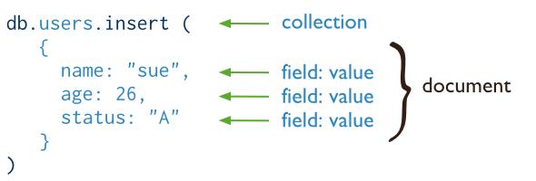
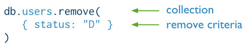

# 写操作概述

- 写操作指的是创建或修改数据库中的数据；
- MongoDB中，写操作的目标是单个集合；
- 对于单个文档，所有写操作都是原子性的。
- 写操作分为三类：插入、更新、删除
- No insert, update, or remove can affect more than one document atomically.
- 对于更新和删除操作，你可以像查询操作一样为其指定一个筛选条件，以确定需要更新或删除的文档。
- MongoDB allows applications to determine the acceptable level of acknowledgement required of write operations.

## 插入

使用 `db.collection.insert()` 可以添加一个新文档到集合中。

下图描述了插入操作：



使用SQL的插入操作是这样的：


### 示例

以下操作插入一个新文档到`users`集合中。新的文档有`name`、`age`、`status`和`_id`四个字段，其中，`_id`字段必须字段，它的值可以由系统自动生成，也可以由应用程序指定。

   ```
   db.users.insert(
      {
         name: "sue",
         age: 26,
         status: "A"
      }
   )
   ```

### Insert Behavior

- 如果你没有为新文档添加 `_id` 字段，系统将为其自动生成一个；
- 如果你手动为新文档添加了 `_id` 字段，此字段的值在当前集合中必须是唯一的

### 插入文档的其他方法

你可以使用 `update` 方法集合`upsert`选项添加文档。

## 更新

- `db.collection.update()` 用于更新已存在的文档；
- `db.collection.update()` 方法接收一个查询文档，以绝对哪些文档将被更新；
- `db.collection.update()` 方法同时也接收一个更新动作参数和一个选项参数，以绝对更新的行为。
- 更新操作对单个文档具有原子性。

更新操作图示：


使用SQL的更新操作是这样的：


### 示例

```
db.users.update(
   { age: { $gt: 18 } },
   { $set: { status: "A" } },
   { multi: true }
)
```


### Default Update Behavior

- 默认情况下，`update` 只更新一个文档，除非在选项中指明；
- `update` 方法要么更新指定的字段，要么替换整个文档；
- When performing update operations that increase the document size beyond the allocated space for that document, the update operation relocates the document on disk.

### Update Behavior with the upsert Option

如果`upsert`选项为true，且给定的查询条件未能在集合中找到相应的文档，那么系统将会插入一个新的文档。

## 删除

- `db.collection.remove()` 用于从集合中删除文档。
- `db.collection.remove()` 接收一个查询文档作为参数，以决定哪些文档需要被删除。

删除操作图示：



SQL中的删除操作：


### 示例

```
db.users.remove(
   { status: "D" }
)
```

### Remove Behavior

默认情况下，`db.collection.remove()`方法删除符合查询条件的所有文档。我们也可以通过设置相应的选项来限制一次操作将删除的文档。

## Isolation of Write Operations

The modification of a single document is always atomic, even if the write operation modifies multiple embedded documents within that document. No other operations are atomic.

If a write operation modifies multiple documents, the operation as a whole is not atomic, and other operations may interleave. You can, however, attempt to isolate a write operation that affects multiple documents using the isolation operator.

For more information Atomicity and Transactions.

## Additional Methods

The db.collection.save() method can either update an existing document or insert a document if the document cannot be found by the _id field. See db.collection.save() for more information and examples.

MongoDB also provides methods to perform write operations in bulk. See Bulk() for more information.