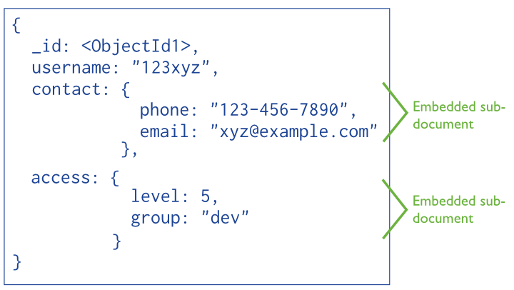

# 数据建模概述

- 与SQL数据库不同，MongoDB中的数据具有灵活的模式；
- MongoDB的集合并不强制其中的文档具备统一的数据结构；
- 这种灵活性使对象到文档的映射更加简单；
- 在数据建模时，要解决的关键问题是如何平衡应用需求、数据库引擎性能及数据获取模式之间的关系；

## Document Structure
在设计数据模型时，我们主要围绕数据结构以及数据之间的关系进行考虑。在MongoDB中，一般有两种方法用来表示数据之间的关系：*引用* 和 *内嵌文档*

### 引用
引用通过存储另一个文档的“引用”来保存两个文档之间的关系。这种方法与SQL数据库类似。

### 内嵌文档
内嵌文档通过将两个文档合并成一个来存储两者之间的关系。

## 写操作的原子性

- MongoDB中，文档级的写操作具有原子性，多个文档或集合的写操作则没有；
- 使用内嵌文档设计的数据模型由于将多个数据对象存放在同一个文档中，因此，对这些数据的写操作是天然具有原子性的；
- 使用引用方式建模时，对多个文档的写操作则不具有原子性。