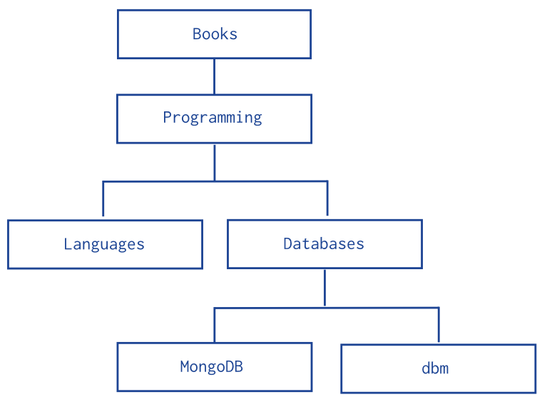

# 使用祖先节点数组方式进行树形结构建模

## Overview

此文档描述如何对树形结构数据使用祖先节点数组的方式进行建模
## Pattern




插入文档：

```
db.categories.insert( { _id: "MongoDB", ancestors: [ "Books", "Programming", "Databases" ], parent: "Databases" } )
db.categories.insert( { _id: "dbm", ancestors: [ "Books", "Programming", "Databases" ], parent: "Databases" } )
db.categories.insert( { _id: "Databases", ancestors: [ "Books", "Programming" ], parent: "Programming" } )
db.categories.insert( { _id: "Languages", ancestors: [ "Books", "Programming" ], parent: "Programming" } )
db.categories.insert( { _id: "Programming", ancestors: [ "Books" ], parent: "Books" } )
db.categories.insert( { _id: "Books", ancestors: [ ], parent: null } )
```

- 查询一个节点的所有祖先节点：
	`db.categories.findOne( { _id: "MongoDB" } ).ancestors`

- 为了使查询更快捷，需要对ancestors属性进行索引：
	- `db.categories.createIndex( { ancestors: 1 } )`

- 根据节点的所有后代节点：
	`db.categories.find( { ancestors: "Programming" } )`