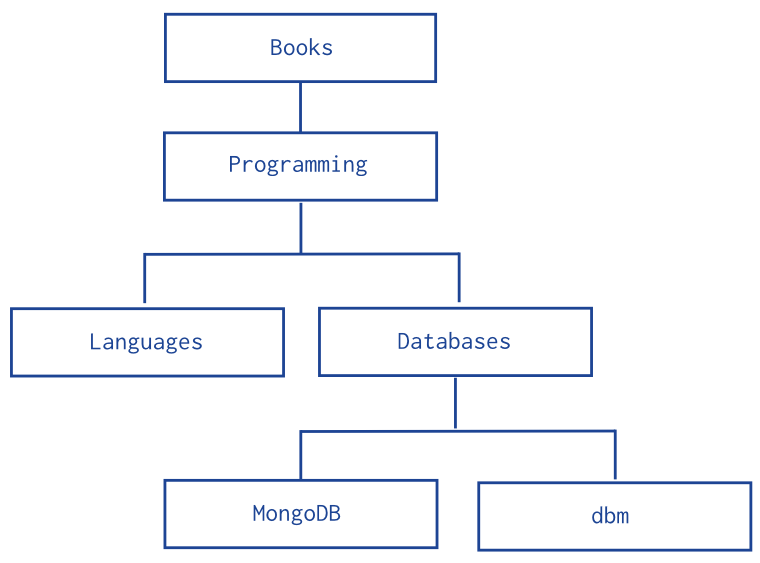

# 使用子节点引用方式进行树形结构建模

## Overview

本文档描述如何对树形结构数据使用父节点引用的方式进行建模

## Pattern

子节点引用模式将树结构中的每一个节点存储在一个单独的文档中，并将该节点的所有子节点引用存储在文章中。



使用子节点引用方式插入文档：

```
db.categories.insert( { _id: "MongoDB", children: [] } )
db.categories.insert( { _id: "dbm", children: [] } )
db.categories.insert( { _id: "Databases", children: [ "MongoDB", "dbm" ] } )
db.categories.insert( { _id: "Languages", children: [] } )
db.categories.insert( { _id: "Programming", children: [ "Databases", "Languages" ] } )
db.categories.insert( { _id: "Books", children: [ "Programming" ] } )
```

- 使用这种方式可以快速获得节点的所有子节点：

	`db.categories.findOne( { _id: "Databases" } ).children`

- 为了更快检索，可以对children字段设置索引
	`db.categories.createIndex( { children: 1 } )`

- 根据子节点查询它的父节点
	`db.categories.find( { children: "MongoDB" } )	
