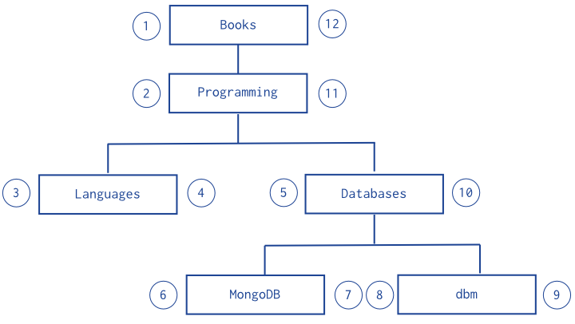

# 使用集合套方式进行树形结构建模

# Overview

此文档描述如何使用集合套（Nested Sets）的方式对树形结构进行建模，以便提高子树的查找效率。

## Pattern

- 集合套模式对树的每个节点进行两次（中序）遍历；
- 集合套模式使用一个文档记录单个节点，并在文档中记录节点的父节点，以及两次遍历产生的左右顺序值。




插入文档： 

```
db.categories.insert( { _id: "Books", parent: 0, left: 1, right: 12 } )
db.categories.insert( { _id: "Programming", parent: "Books", left: 2, right: 11 } )
db.categories.insert( { _id: "Languages", parent: "Programming", left: 3, right: 4 } )
db.categories.insert( { _id: "Databases", parent: "Programming", left: 5, right: 10 } )
db.categories.insert( { _id: "MongoDB", parent: "Databases", left: 6, right: 7 } )
db.categories.insert( { _id: "dbm", parent: "Databases", left: 8, right: 9 } )
```

我们可以这样查询一个节点的所有后代节点：

```
var databaseCategory = db.categories.findOne( { _id: "Databases" } );
db.categories.find( {
	left: { $gt: databaseCategory.left }, 
	right: { $lt: databaseCategory.right } 
} );
```

- 集合套模式对于查找子树（后代节点）的操作效率很高，但对于树的修改操作来讲，这种模型效率极低。因此，集合套模式主要用于静态树形结构数据的建模。
